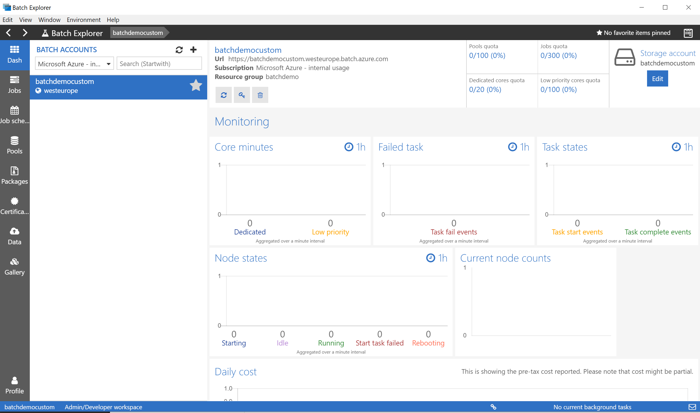
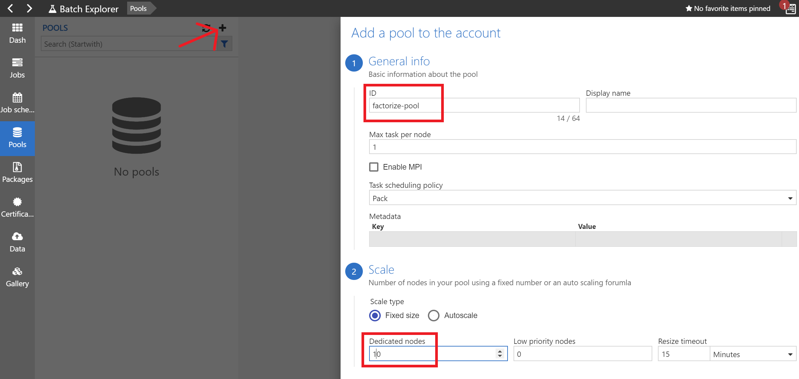
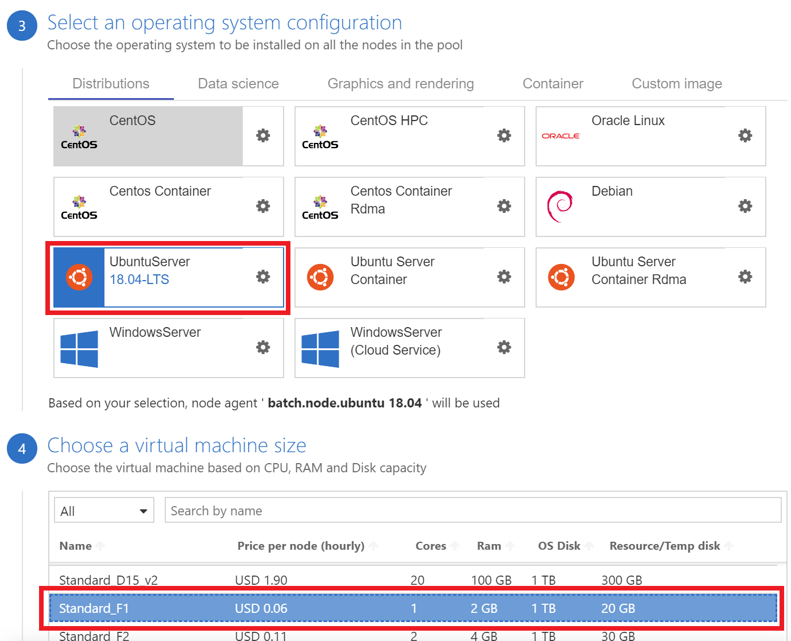
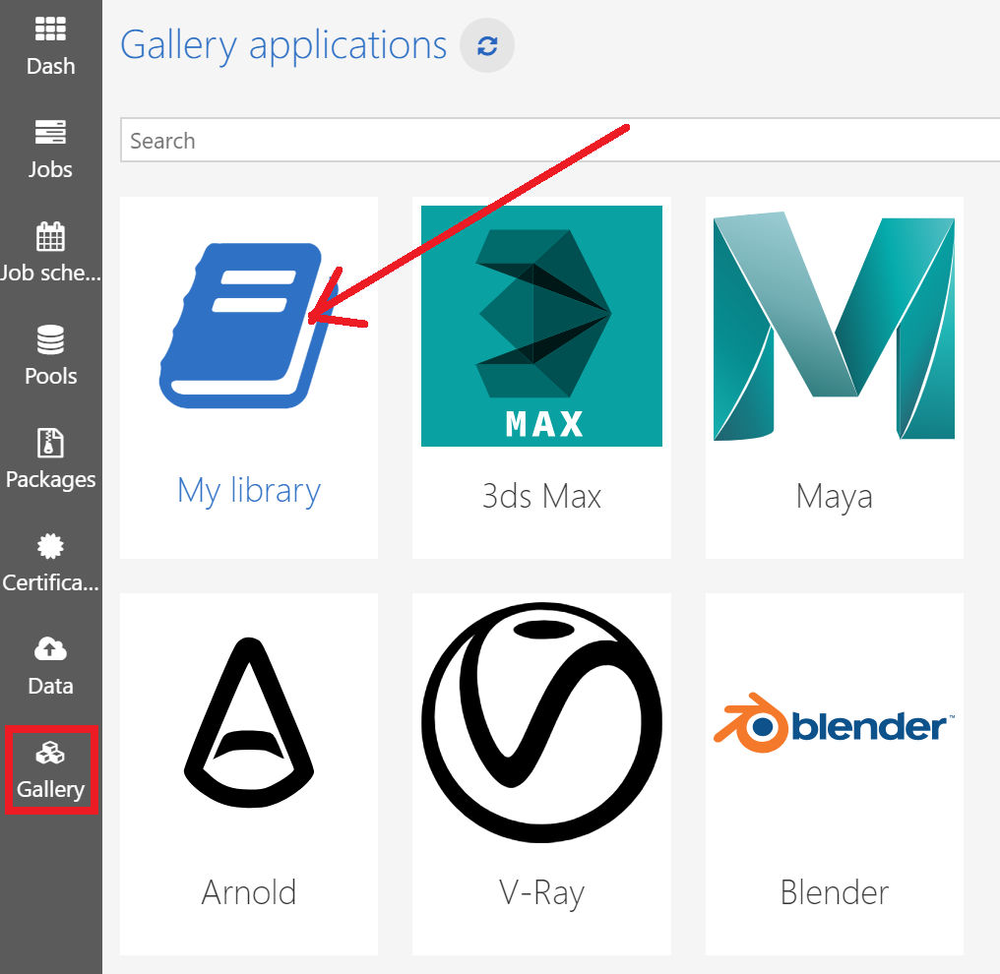
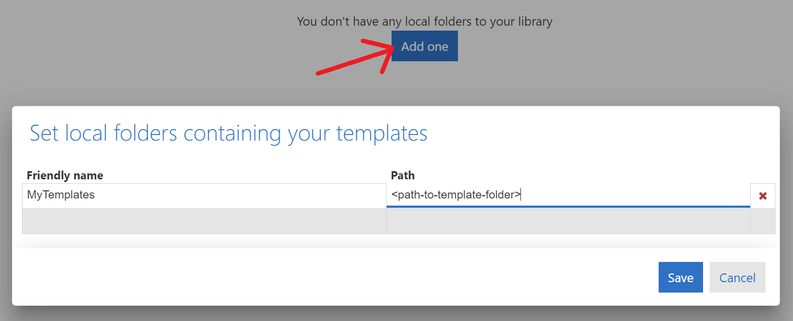
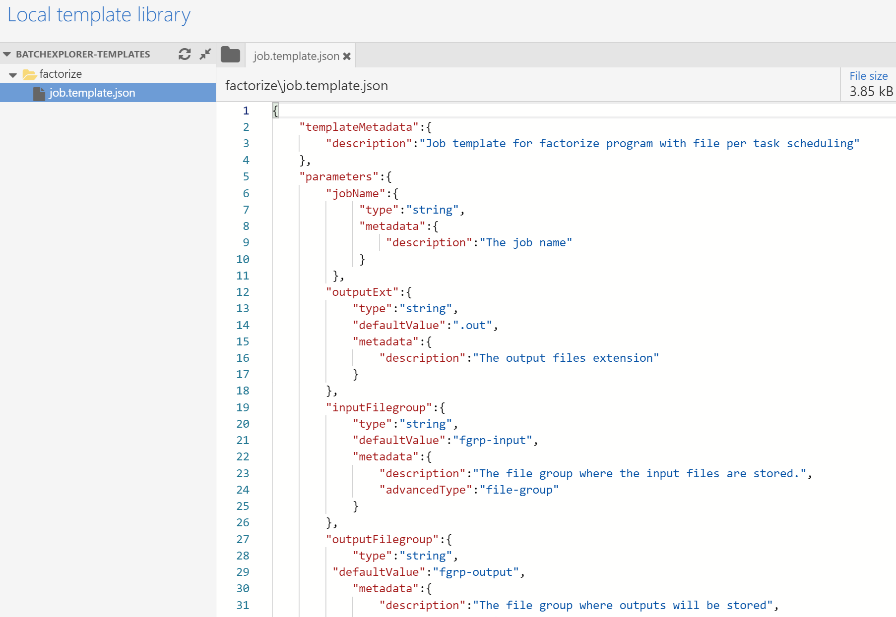
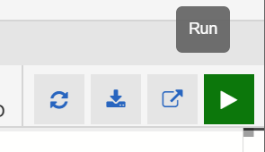
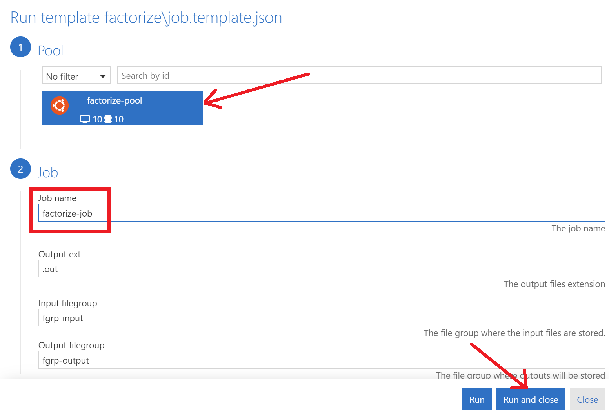
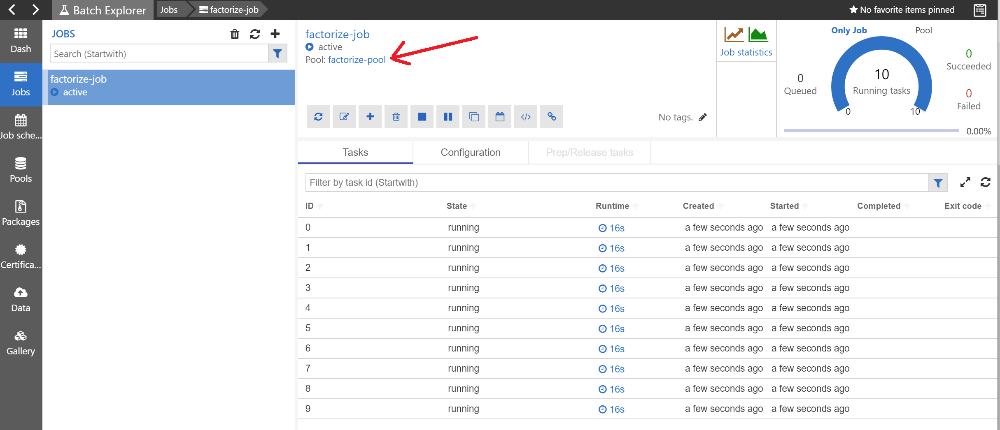
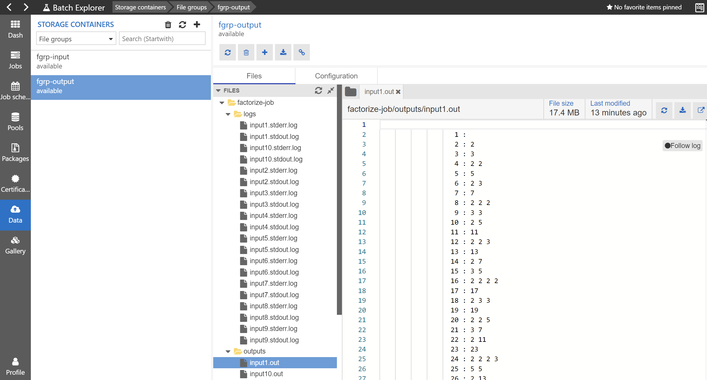

# Running custom code in parallel with Batch Explorer
The aim of this workshop is to show how to run a custom program code at scale on Azure Batch, using Batch Explorer and job templates.

## Preparation
### 1. Create a Batch account
1. Login to [Azure portal](https://portal.azure.com), click on "Create a resource", type "batch service" in the search box and select *Batch service* from the list:


2. Click "Create" button and fill out the Batch account creation form.


3. Click "Select storage account" and create a storage account linked to your Batch account:


4. Click "Review+create" button and then "Create" to confirm creation of the Batch account:


### 2. Install Batch Explorer
*Note: Instructions below assume version 0.19.2 of Batch Explorer.*

1. Goto [Batch Explorer](https://azure.github.io/BatchExplorer/) webpage and download the Batch Explorer installer package adequate for your OS system.


2. Install Batch Explorer package (action is OS-dependent)
Tip: You may want to download a portable zip package and unzip instead of performing a full install.

3. Start Batch Explorer (run BatchExplorer.exe or its Linux/iOS equivalent) and login to your Azure account:

You should now see your Batch account on the Dashboard pane and the linked storage account in the top-right corner:


## Custom code execution
### 1. Build the custom program
The custom code used in our example is a simple C program [factorize.c](factorize.c) calculating factorization of integer numbers. 
The program reads integers from an input file given as the first command-line argument and stores the result to an output file given as the 2nd command-line argument.

Compile the source code e.g. on a Ubuntu 18.04 system and get familiar with the program operation:
```bash
$ gcc -o factorize factorize.c
$ ./factorize
Missing command-line argument, syntax: ./factorize <input> <output>
```
As an example, let's calculate factorization of all numbers from 1 to 500000:
```bash
$ seq 1 10000 > input
$ ./factorize input output
$ less output
```
### 2. Create application package
1. Compress the program executable with zip:
```bash
$ zip factorize.zip factorize
```

2. Create an Azure Batch application package

Goto *Packages* tab in Batch Explorer and click '+' icon:


Fill out the create apppackage form fields and click *Select a package* button to upload the program zip file:


Click *Save and close* button to save the application package. 

### 3. Create an input file group

Generate the input files and download to local folder:
```bash
$ mkdir input
$ for i in `seq 1 10`; do cp input input$i; done
$ zip input.zip input? input10
```
(In this example we're generating 10 identical input files with numbers from 1 to 500000)

Goto *Data* tab in Batch Explorer and create a file group with the generated input files.


Hint: You can create a file group and upload the input files directly from a folder on your local system:


### 4. Create an output filegroup 
Goto *Data* tab in Batch Explorer and create an empty file group:


Provide a name for the output filegroup, e.g. *output*:


### 5. Create an Azure Batch pool
Goto *Pools* tab in Batch Explorer and click '+' icon to create a new pool. 
Provide the pool name e.g. *factorize-pool* and the amount of nodes e.g. *10*:


Select OS image *Ubuntu 18.04* and virtual machine size *Standard_F1*:


Select application package *factorize v1.0* and click *Save and close* button to create the pool.

### 6. Run the job from the template
a. Create a local folder in your system for storing Batch Explorer templates, e.g. *C:\Users\User\Documents\batchexplorer\templates*.
Unzip [factorize-template.zip](factorize-template.zip) package to this folder.

b. Goto *Gallery* tab in Batch Explorer and click *My library* button: 


Add your template folder to the library:

Find the job template in the left pane and open it:


c. Run the job template by clicking the green arrow button in the top-right corner:


d. In the job template form that opens select the pool and provide a name for the job:

You may modify the output extension or select different filegroups for input or output in the appropriate fields, or leave the default values. 
Click *Run and close* button and wait for the job to start.

e. Once the job is started Batch Explorer should open the job status page where you can monitor live the job progress:

You can observe all the tasks created in the job and monitor their status.
Hint: You may want to check the status of the pool executing the job by clicking its link under the job name.

f. After the job is finished goto *Data* tab and open the output filegroup:

You can find the output and stdout+stderr log files of all tasks in *outputs* and *logs* folders under the job folder 
Hint: You can display the file content directly in Batch Explorer or download the files to your local system with the right-click context command.
