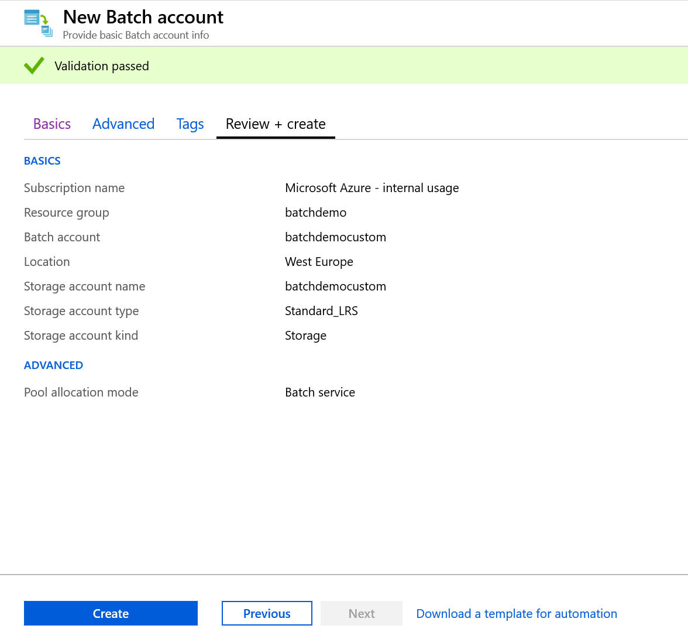

# Running custom code at scale with Batch Explorer
The aim of this workshop is to show how to run a custom program code at scale on Azure Batch, using Batch Explorer and job templates.

## 1. Prerequisite
### Install Batch Explorer
Goto [Batch Explorer](https://azure.github.io/BatchExplorer/) webpage and download the Batch Explorer installer package for your OS system. 

You may want to download a zip package and unzip instead of performing full install.

Note: Instructions below assume version 0.19.2 of Batch Explorer.

### Create a Batch account
Login to [Azure portal](https://portal.azure.com), click on "Create a resource", type "batch service" in the search box and select *Batch service* from the list:

Click "Create" button and fill out the Batch account creation form.

Click "Select storage account" and create a storage account linked to your Batch account:

Click "Review+create" button and then "Create" to confirm creation of the Batch account:


### Open Batch Explorer
To start Batch Explorer run BatchExplorer.exe (or Linux/iOS equivalent) and login to your Azure account:

You should now see your Batch account on the Dashboard pane and the linked storage account in the top-right corner:


## 1. Create Azure Batch application package with custom code
Compile the source code on Ubuntu system:
```bash
$ gcc -o customcode customcode.c
```
Compress with zip:
```bash
$ zip customapp.zip customcode
```
### Create an application package in Batch Explorer and upload the zip file:


## 2. Create input file group
Replicate the inputfile and copy to local folder:
```bash
$ mkdir input
$ for i in `seq 1 20`; do cp inputfile input/file$i; done
```
Upload input files to input file group
