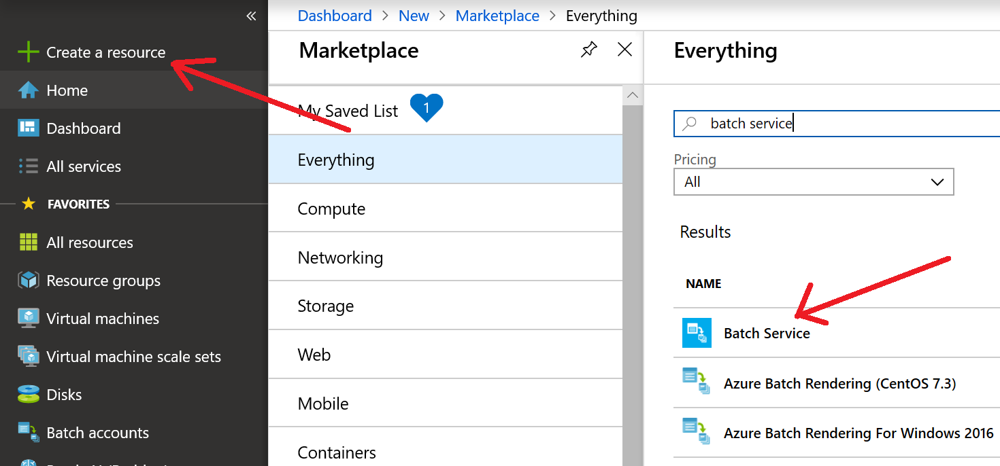
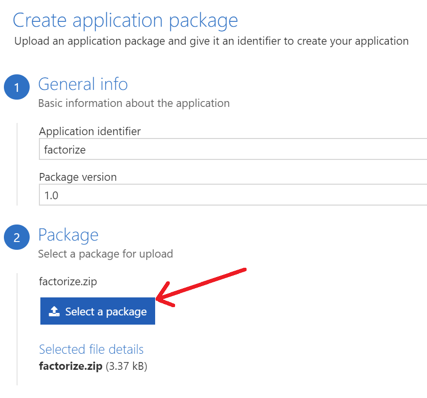
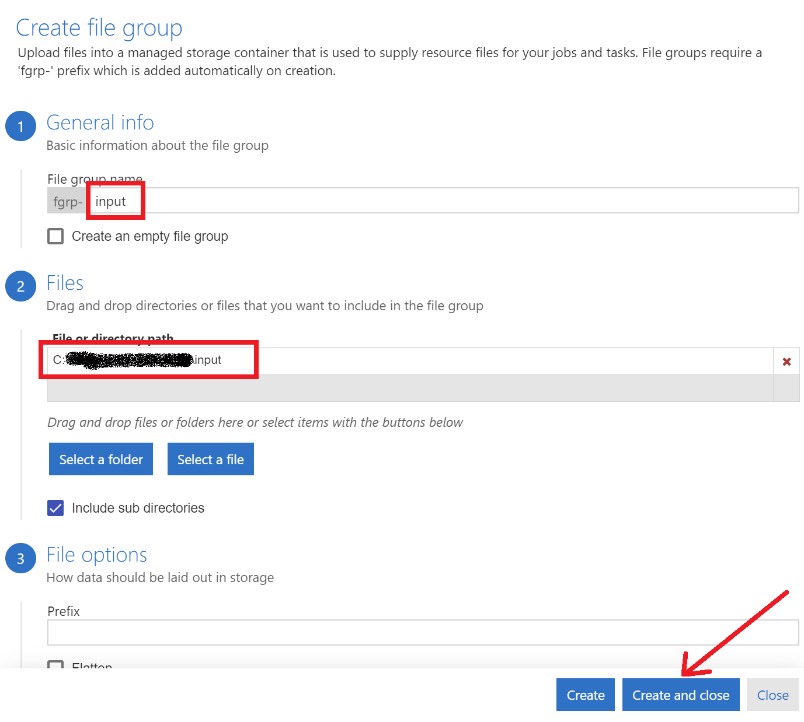

# Running custom code in parallel with Batch Explorer
The aim of this workshop is to show how to run a custom program code at scale on Azure Batch, using Batch Explorer and job templates.

## 1. Prerequisite
### Install Batch Explorer
Goto [Batch Explorer](https://azure.github.io/BatchExplorer/) webpage and download the Batch Explorer installer package for your OS system. 

You may want to download a zip package and unzip instead of performing full install.

Note: Instructions below assume version 0.19.2 of Batch Explorer.

### Create a Batch account
Login to [Azure portal](https://portal.azure.com), click on "Create a resource", type "batch service" in the search box and select *Batch service* from the list:

Click "Create" button and fill out the Batch account creation form.

Click "Select storage account" and create a storage account linked to your Batch account:

Click "Review+create" button and then "Create" to confirm creation of the Batch account:


### Open Batch Explorer
To start Batch Explorer run BatchExplorer.exe (or Linux/iOS equivalent) and login to your Azure account:

You should now see your Batch account on the Dashboard pane and the linked storage account in the top-right corner:


## 1. Build custom program
The custom code used in our example is a C program [factorize.c](https://github.com/tojozefi/azurebatch/raw/master/customcode/factorize.c) calculating factorization of integer numbers. 
The program reads input integers from an input file given as the first command-line argument and stores the result to an output file given as the 2nd command-line argument.
Compile the source code e.g. on a Ubuntu system and get familiar with the program operation:
```bash
$ gcc -o factorize factorize.c
$ ./factorize
Missing command-line argument, syntax: ./factorize <input> <output>
```
As an example, let's calculate factorization of all numbers from 1 to 500000:
```bash
$ seq 1 10000 > input
$ ./factorize input output
$ less output
```
## 2. Create application package
### Compress the program executable with zip:
```bash
$ zip factorize.zip factorize
```
### Create an application package in Batch Explorer
Goto *Packages* tab and click '+' icon:


Fill out the create apppackage form fields and click *Select a package* button to upload the program zip file:

Click *Save and close* button to save the application package. 

## 3. Create input file group
Generate the input files and download to local folder:
```bash
$ mkdir input
$ for i in `seq 1 10`; do cp input input$i; done
$ zip input.zip input? input10
```
(In this example we're generating 10 identical input files with numbers from 1 to 500000)

Goto *Data* tab in Batch Explorer and create a file group with the generated input files.


Hint: You can create a file group and upload the input files directly from a local folder:


