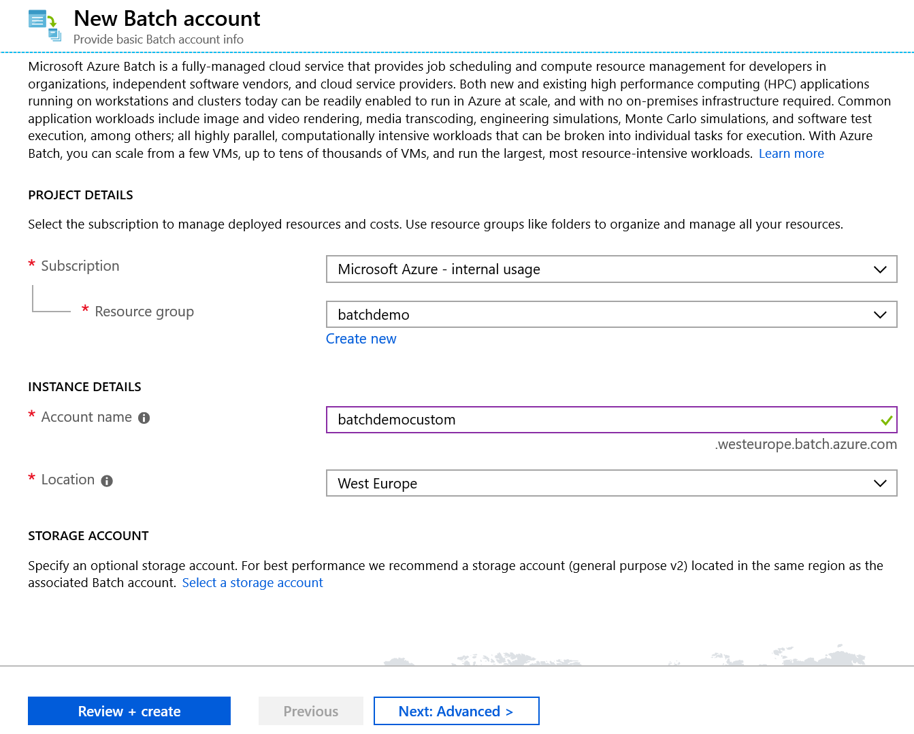
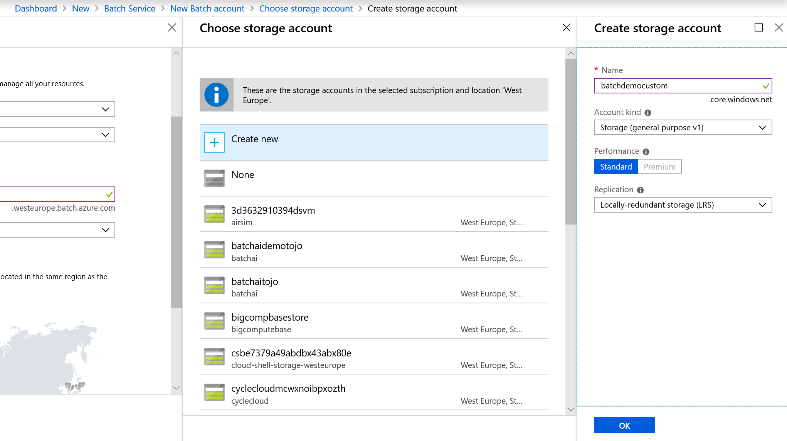
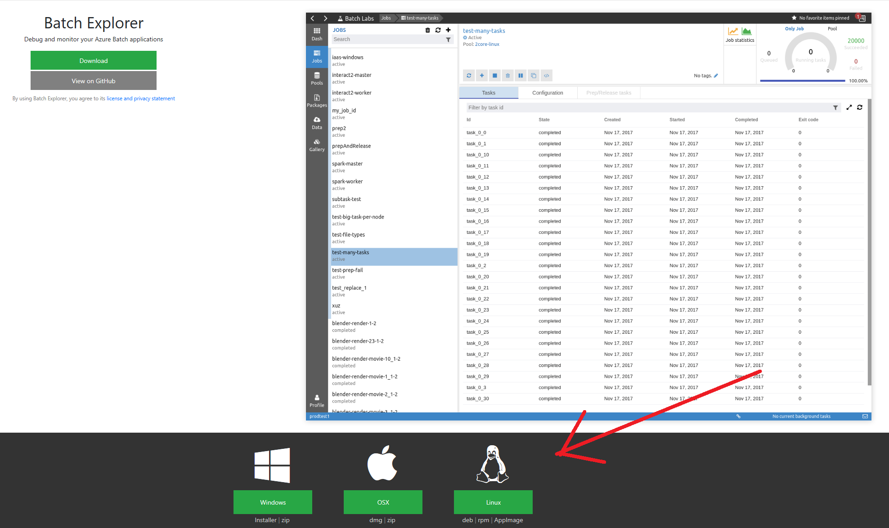
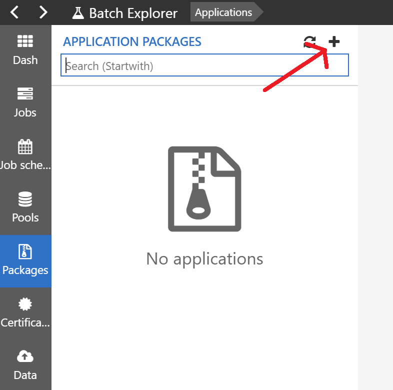
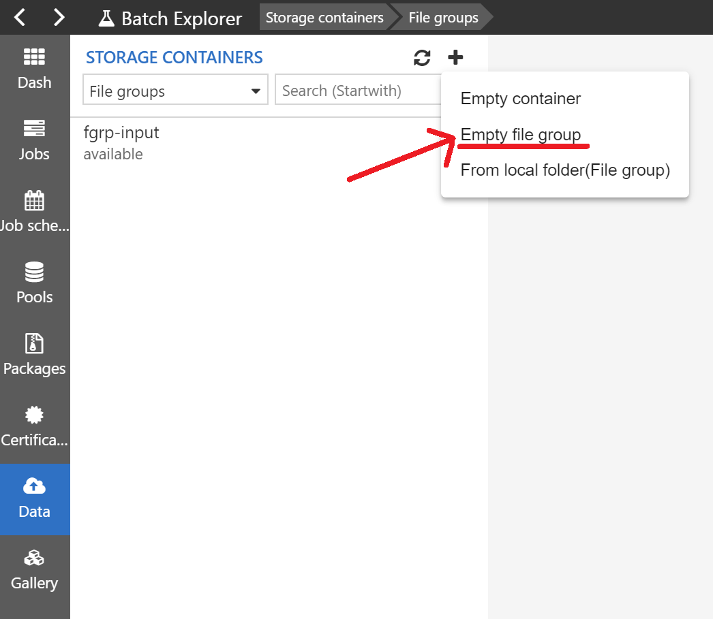

# Running custom code in parallel with Batch Explorer
The exercise shows how to run a custom program code at scale on Azure Batch, using Batch Explorer and job templates. 

Job templates are part of [Azure Batch CLI extension](https://github.com/Azure/azure-batch-cli-extensions/blob/master/README.rst) package, see [here](https://github.com/Azure/azure-batch-cli-extensions/blob/master/doc/templates.md) for more information. 


## Preparation
### 1. Redeem your Azure promo code
1. To redeem your Azure promo code you need an email account not previously used for Azure. To set up a brand-new Microsoft account follow [these](Setup_Microsoft_account.pdf) instructions.

2. Follow the instructions on [Azure pass redemption page](https://www.microsoftazurepass.com/Home/HowTo) to redeem your Azure promo code.

Azure promo codes:
1.  ...

### 2. Create a Batch account
1. Login to [Azure portal](https://portal.azure.com), click on "Create a resource", type "batch service" in the search box and select *Batch service* from the list:


2. Click "Create" button and fill out the Batch account creation form.


3. Click "Select storage account" and create a storage account linked to your Batch account:


4. Click "Review+create" button and then "Create" to confirm creation of the Batch account:


### 3. Install Batch Explorer
*Note: Instructions below assume version 2.1.2-stable.349 of Batch Explorer.*

1. Goto [Batch Explorer](https://azure.github.io/BatchExplorer/) webpage and download the Batch Explorer installer package adequate for your OS system.


2. Install Batch Explorer package (action is OS-dependent)
Tip: You may want to download a portable zip package and unzip instead of performing a full install.

3. Start Batch Explorer (run BatchExplorer.exe or its Linux/iOS equivalent) and login to your Azure account:

You should now see your Batch account on the Dashboard pane and the linked storage account in the top-right corner:


## Custom code execution
### 1. Build the custom program
The custom code used in our example is a simple C program [factorize.c](factorize.c) calculating factorization of integer numbers. 
The program reads integers from an input file provided as the first command-line argument and stores the result to an output file provided as the 2nd command-line argument.

Compile the source code e.g. on a Linux system and get familiar with the program operation:
```bash
$ gcc -o factorize factorize.c
$ ./factorize
Missing command-line argument, syntax: ./factorize <input> <output>
```
Tip: If you don't have a working Linux system at hand, you may want to use [Azure cloud shell](https://shell.azure.com) in your Azure account (select Bash)

As an example, let's calculate factorization of all numbers from 1 to 100:
```bash
$ seq 1 100 > inputfile
$ ./factorize inputfile outputfile
$ less outputfile
```
### 2. Create application package
1. Compress the program executable with zip:
```bash
$ zip factorize.zip factorize
```
Download the zip package to your local system.

2. Create an Azure Batch application package

Goto *Packages* tab in Batch Explorer and click '+' icon:


Fill out the create apppackage form fields and click *Select a package* button to upload the program zip file:


Click *Save and close* button to save the application package. 

### 3. Create an input file group

Generate the input fileset for parallel calculation. In our example we're generating 10 identical input files with numbers from 1 to 500000:  
```bash
$ mkdir input; cd input
$ seq 1 500000 > input1
$ for i in `seq 2 10`; do cp input1 input$i; done
$ cd ..; zip input.zip input
```
Download the zip file to your local system and uncompress. You should have a folder *input* with 10 input files inside. 

Goto *Data* tab in Batch Explorer and click '+' icon to create a new file group, selecting *From local folder (filegroup)*:


Provide a name for the filegroup (e.g. *fgrp-input*), the path to *input* folder on your local system and confirm with *Create and close* button:


### 4. Create an output filegroup 
Goto *Data* tab in Batch Explorer and create an empty file group:


Provide a name for the output filegroup, e.g. *output*:


### 5. Create an Azure Batch pool
Goto *Pools* tab in Batch Explorer and click '+' icon to create a new pool. 
Provide the pool name e.g. *factorize-pool* and the amount of nodes e.g. *10*:


Select OS image (equivalent to the Linux distribution that you used to build *factorize* program) and virtual machine size for the pool e.g. *Standard_F1*:


Select application package *factorize v1.0* and click *Save and close* button to create the pool.


### 6. Run the job from the template
a. Download the *factorize* program's [job template](factorize-job.json) to the local filesystem.

b. Load the *factorize* program's job template into Batch Explorer.

Goto *Gallery* tab in Batch Explorer and click *Pick a local template* button: 


The job template used in our example implements a task-per-file task factory which generates a task for each file in the defined input filegroup. See [here](https://github.com/Azure/azure-batch-cli-extensions/blob/master/doc/taskFactories.md) for more information about task factories.   

The tasks will process all files in the input filegroup in parallel and generate the relevant output files with names appended by defined extension.

c. In the job template form that opens select the pool and provide a name for the job:

Output extension is appended to the name of the input file to construct an output filename.

You may want to modify the output extension or input and output filegroups in the appropriate fields, or you may just leave the default values. 

Click *Run and close* button and wait for the job to start.

e. Once the job is started Batch Explorer should open the job status page where you can monitor live the job progress:

You can observe all the tasks created in the job and monitor their status.

Hint: You may want to check the status of the pool executing the job by clicking its link under the job name.

f. After the job is finished goto *Data* tab and open the output filegroup:

You can find the output and stdout+stderr log files of all tasks in *outputs* and *logs* folders under the job folder 

Hint: You can display the file content directly in Batch Explorer or download the files to your local system with the right-click download context command.
